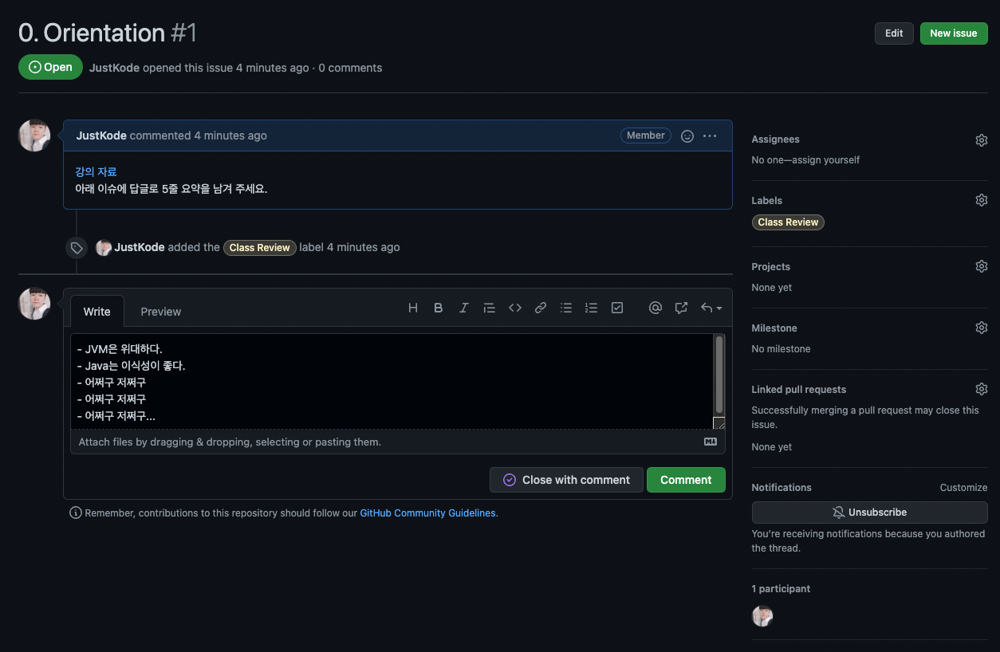
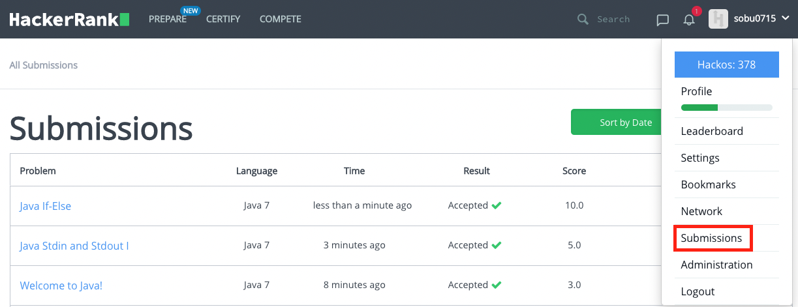
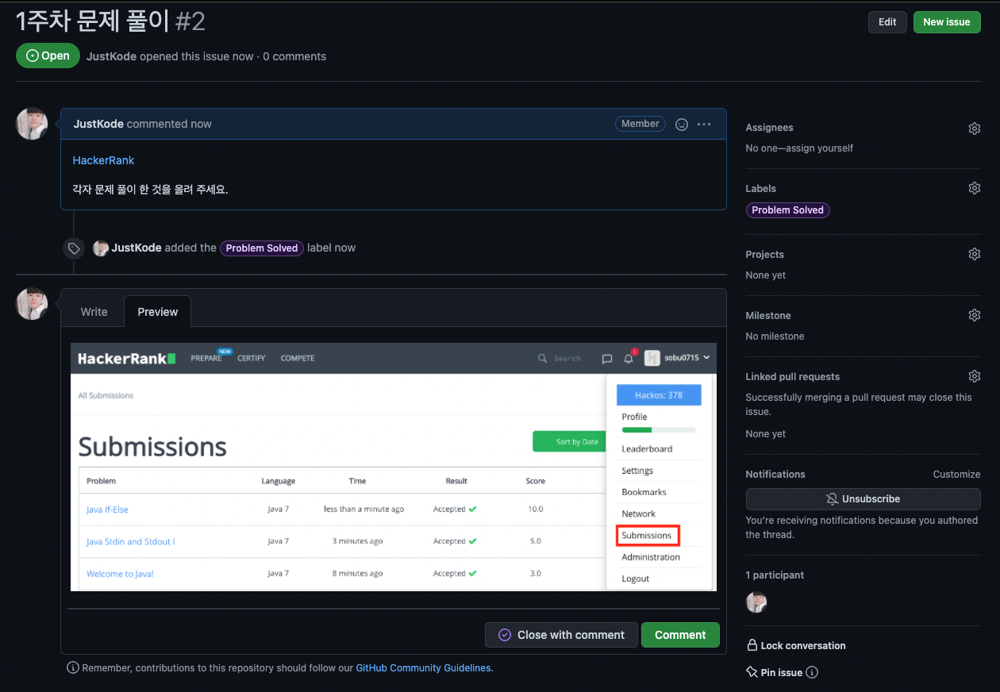

## C++ to Java
- 스터디 진행: 매주 화요일, 목요일 오후 7시, Discord 에서
- 진행 예상 시간: 30분 ~ 1시간

### Study 진행 방법
스터디에 참여 해 주신 분들이 해야 하는 것들은 다음과 같습니다.

0. 이 스터디에서는 **문법**을 다루지 않습니다. **C++**과 **Java**의 문법은 꽤나 유사하기 때문 입니다. 고로 문법에 대한 공부는 따로 하셔야 합니다. [참고 사이트](http://www.tcpschool.com/java/java_intro_basic)

1. **C++ to Java** 강의를 진행 한 후에는, 이를 "5줄 요약" 하여, 각 회차 별로 존재하는 **Github Issue**에 답글을 남겨 주세요.

	

2. [HackerRank](https://www.hackerrank.com/domains/java) 에서 매주 문제를 해결 한 후, `Submission`을 캡처 하여 해당 주차의 **Github Issue** 에 캡처 본을 올려 주세요.

	

	

### Lecture Note
0. Orientation [[Link]](https://justkode.kr/java/cpp-to-java-0)
1. System Class [[Link]](https://justkode.kr/java/cpp-to-java-1)
2. Object-Oriented Programming [[Link]](https://justkode.kr/java/cpp-to-java-2)
3. 상속, 다형성, 인터페이스 [[Link]](https://justkode.kr/java/cpp-to-java-3)
4. Package와 Import [[Link]](https://justkode.kr/java/cpp-to-java-4)
5. 예외 처리 [[Link]](https://justkode.kr/java/cpp-to-java-5)
6. Java.lang 패키지 & 유용한 클래스 [[Link]](https://justkode.kr/java/cpp-to-java-6)